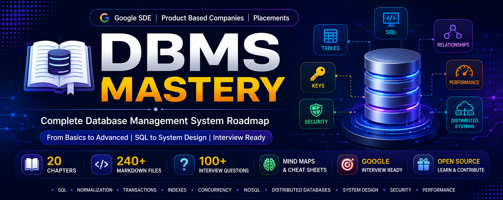

# 🚀 DBMS Mastery



🌐 **DBMS Mastery**

A complete Database Management Systems repository for Software Engineering interviews, Google SDE preparation, placements, and quick revision.


---

## 📊 Repository Statistics

| Metric                 | Count |
| ---------------------- | ----- |
| 📁 Chapters            | 20    |
| 📄 Markdown Files      | 260+  |
| ❓ Interview Questions  | 500+  |
| 📋 Cheat Sheets        | 20    |
| 🧠 Mind Maps           | 20    |
| ⚡ Quick Revision Notes | 20    |
| ❌ Common Mistakes      | 20    |
| 💬 FAQs                | 20    |

---

## 📌 Repository Status

| Status                  | Value      |
| ----------------------- | ---------- |
| 📚 Chapters             | ✅ Complete |
| 🔄 Actively Maintained  | ✅ Yes      |
| 🎯 Interview Ready      | ✅ Yes      |
| 🌍 Open Source          | ✅ Yes      |
| 👨‍🎓 Beginner Friendly | ✅ Yes      |

---

## 📂 Repository Structure

| Chapter | Topic                    |
| ------- | ------------------------ |
| 01      | Introduction to DBMS     |
| 02      | Database Architecture    |
| 03      | ER Model                 |
| 04      | Relational Model         |
| 05      | Keys and Constraints     |
| 06      | SQL Basics               |
| 07      | SQL Joins                |
| 08      | Normalization            |
| 09      | Transactions and ACID    |
| 10      | Concurrency Control      |
| 11      | Indexes                  |
| 12      | Views and Triggers       |
| 13      | Stored Procedures        |
| 14      | Database Security        |
| 15      | NoSQL Databases          |
| 16      | Database Internals       |
| 17      | Distributed Databases    |
| 18      | System Design DBMS       |
| 19      | DBMS Interview Questions |
| 20      | DBMS Interview Revision  |

---

## ✨ Features

* ✅ Beginner Friendly
* ✅ Google Interview Focused
* ✅ Real-World Examples
* ✅ SQL Queries
* ✅ Interview Questions
* ✅ Quick Revision Notes
* ✅ Cheat Sheets
* ✅ Mind Maps
* ✅ Common Mistakes
* ✅ FAQs

---

## 🗺 Learning Roadmap

```text
Introduction to DBMS
        ↓
Database Architecture
        ↓
ER Model
        ↓
Relational Model
        ↓
Keys & Constraints
        ↓
SQL Basics
        ↓
SQL Joins
        ↓
Normalization
        ↓
Transactions & ACID
        ↓
Concurrency Control
        ↓
Indexes
        ↓
Views & Triggers
        ↓
Stored Procedures
        ↓
Database Security
        ↓
NoSQL Databases
        ↓
Database Internals
        ↓
Distributed Databases
        ↓
System Design DBMS
        ↓
Interview Questions
        ↓
Interview Revision
```

---

## 👨‍💻 Who Is This Repository For?

* 🎓 Students
* 👨‍💻 Software Engineers
* 🌱 Beginners
* 📚 Computer Science Learners
* 🚀 Google Interview Preparation
* 🏢 Product-Based Companies
* 🎯 College Placements

---

## ⭐ Interview Preparation

Every chapter includes:

* 📖 Theory
* 🖼️ Diagrams
* 💡 Real-World Examples
* 📝 SQL Queries
* ❓ Interview Questions
* 📋 Cheat Sheets
* 🧠 Mind Maps
* ⚡ Quick Revision Notes

---

## 📚 Skills Covered

* Database Fundamentals
* Database Design
* ER Modeling
* Relational Databases
* SQL
* Joins
* Normalization
* Transactions
* ACID Properties
* Concurrency Control
* Indexing
* Views
* Triggers
* Stored Procedures
* NoSQL
* Database Security
* Distributed Databases
* System Design

---

## 🚀 How to Use

1. Start with Chapter 1 - Introduction to DBMS.
2. Follow the roadmap sequentially.
3. Practice SQL examples.
4. Solve practice questions.
5. Revise using Cheat Sheets and Mind Maps.
6. Prepare for interviews using Interview Corner.

---

## 🏆 Repository Highlights

* 📘 20 Structured Chapters
* 🎯 Google Interview Focused
* 📄 260+ Markdown Files
* 📝 SQL Examples
* ❓ 500+ Interview Questions
* 📋 Cheat Sheets
* 🧠 Mind Maps
* ⚡ Quick Revision Notes
* 🌍 Open Source

---

## 🤝 Contributing

Contributions are welcome.

Please read CONTRIBUTING.md before submitting a Pull Request.

---

## 👨‍💻 Author

**Saikumar Kadiri**

* GitHub: https://github.com/kadirisaikumar3
* LinkedIn: https://www.linkedin.com/in/saikumar-kadiri/

---

## 📜 License

This project is licensed under the MIT License.

---

## ⭐ Support the Project

If you found this repository useful:

* ⭐ Star this repository
* 🍴 Fork it
* 📢 Share it with others
* 💡 Suggest improvements

Happy Learning! 🚀
